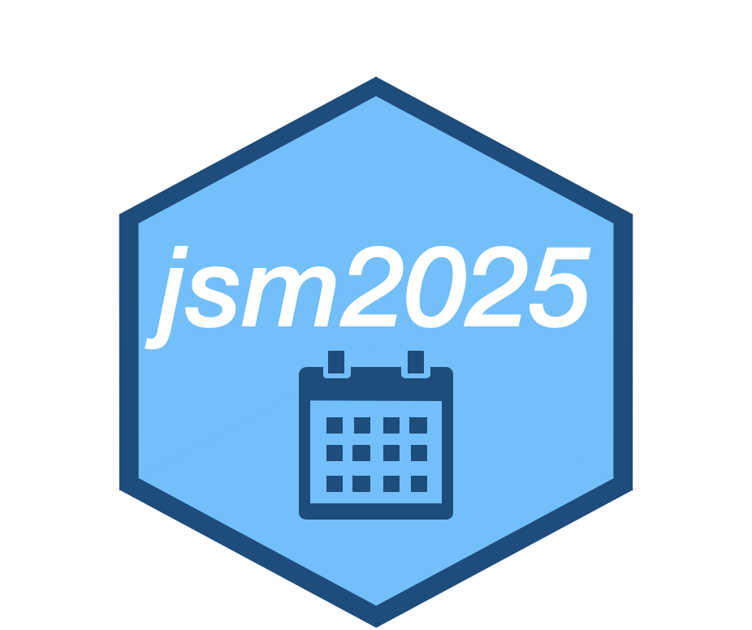
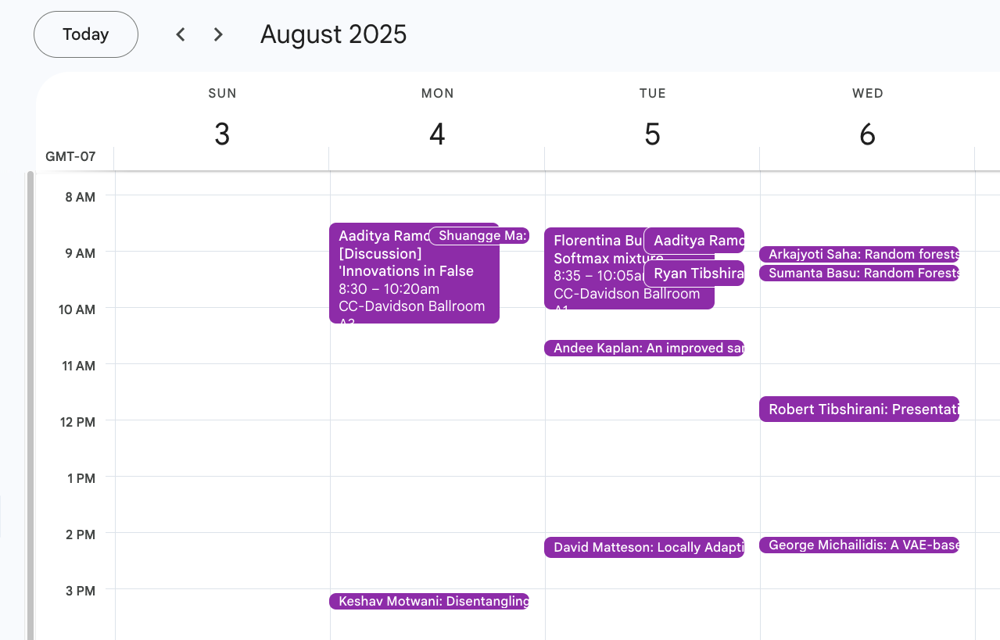

# Navigate the JSM schedule from the comfort of an R console 

<!-- badges: start -->
<!-- badges: end -->

`jsm2025` is an R package with all the JSM talks. It makes personalized
recommendations for talks (based on citation network data) and exports
your schedule as an ical file that can be loaded into Google Calendar
and similar.

### Getting started

You can watch a [video
demo](https://www.youtube.com/watch?v=-k13d_KsSH0&t=1s) of the shiny app
and this R package or read more below.

To install the package:

``` r
remotes::install_github("jacobbien/jsm2025-project", subdir = "jsm2025")
```

An example of the sort of thing you can do with the package:

``` r
# which of my co-authors are at JSM?
my_coauthors <- jsm2025::get_coauthors("Jacob Bien")

# which of the people I cite the most are at JSM?
people_cited_by_me <- jsm2025::get_out_citations("Jacob Bien")

# which of the people who cite me the most are at JSM?
people_citing_me <- jsm2025::get_in_citations("Jacob Bien")

# when are their talks?
schedule <- jsm2025::get_talks(
  speakers = c(my_coauthors, people_cited_by_me[1:12], people_citing_me[1:5]),
  session_types = "Paper",
  days = c("2025-08-03", "2025-08-04", "2025-08-05", "2025-08-06")
)
```

This produces a data frame of talks:

``` r
dplyr::select(schedule, speaker, title)
#> # A tibble: 12 × 2
#>    speaker            title                                                     
#>    <chr>              <glue>                                                    
#>  1 Aaditya Ramdas     [Discussion] 'Innovations in False Discovery Rate Control…
#>  2 Shuangge Ma        Cancer Human Disease Networks (cHDNs) via Deep Learning S…
#>  3 Keshav Motwani     Disentangling Genetic Contributions to Human Brain Connec…
#>  4 Aaditya Ramdas     Conformal changepoint localization                        
#>  5 Florentina Bunea   Softmax mixture ensembles for interpretable latent discov…
#>  6 Ryan Tibshirani    Gradient Equilibrium in Online Learning                   
#>  7 Andee Kaplan       An improved sampler for recursive Bayesian inference      
#>  8 David Matteson     Locally Adaptive Random Walk Stochastic Volatility        
#>  9 Arkajyoti Saha     Random forests for binary geospatial data                 
#> 10 Sumanta Basu       Random Forests for Time Series Data                       
#> 11 Robert Tibshirani  PresentationFF                                            
#> 12 George Michailidis A VAE-based Framework for Learning Multi-Level Neural Gra…
```

See `?get_talks` for the other ways you can filter talks. Finally, you
can export this in the ical format, which can be imported into Google
Calendar and other standard calendars:

``` r
jsm2025::export_calendar_to_ics(schedule, file = "jsm-talks.ics")
```

Once imported into Google Calendar, we get the following:



### About

[We](http://faculty.marshall.usc.edu/jacob-bien/) wrangled decades of
citation and coauthorship data from Semantic Scholar and arxiv to form
these recommendations. Special thanks to [Donna
LaLonde](https://www.linkedin.com/in/donna-lalonde-she-her-a6a41124) and
[Ronald
Wasserstein](https://www.amstat.org/about-asa/ronald-l-wasserstein) this
year for providing JSM program information. We have also included
functionality for exporting your schedule as an ical that can be loaded
into Google Calendar or similar. The result is a package that
streamlines the process of finding talks that you may want to attend.
The first version of this was done as a web app for JSM 2019 with [Ronak
Upadhyaya](https://ronakupadhyaya.github.io/) and the [second
version](https://github.com/jacobbien/jsm2022-project/tree/main/jsm2022),
for JSM 2022, was done with [Yibin
Xiong](https://www.linkedin.com/in/yibin-xiong-936b64204/). `jsm2025`
was written using literate programming. In particular, the entire
package was generated by “litr-knitting” [a single Rmd
file](https://jacobbien.github.io/jsm2025-project/create-jsm2025.html).
To learn more about the `litr` package and the literate programming
approach to writing R packages, see
[here](https://jacobbien.github.io/litr-project/).

### Citation and coauthor data acknowledgments

The citation data came from [Semantic Scholar’s
API](https://api.semanticscholar.org/datasets/v1/release/latest) and is
associated with the following paper:

> Waleed Ammar, Dirk Groeneveld, Chandra Bhagavatula, Iz Beltagy, Miles
> Crawford, Doug Downey, Jason Dunkelberger, Ahmed Elgohary, Sergey
> Feldman, Vu A. Ha, Rodney Michael Kinney, Sebastian Kohlmeier, Kyle
> Lo, Tyler C. Murray, Hsu-Han Ooi, Matthew E. Peters, Joanna L. Power,
> Sam Skjonsberg, Lucy Lu Wang, Christopher Wilhelm, Zheng Yuan,
> Madeleine van Zuylen, Oren Etzioni, *Construction of the Literature
> Graph in Semantic Scholar*. NAACL 2018.

Coauthorship data came also from [arxiv
metadata](https://arxiv.org/help/oa/index).
